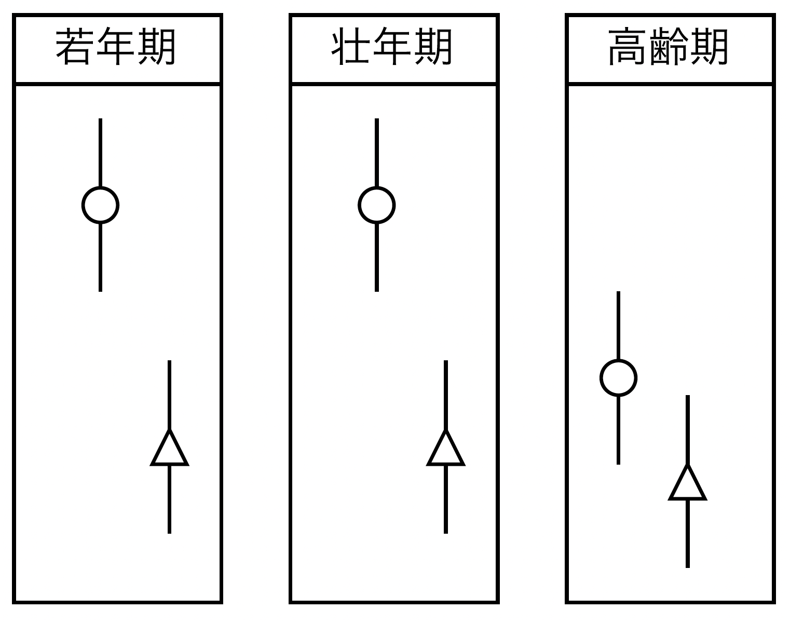

---
execute:
    echo: false
    warning: false
    message: false
    cache: false
author:
  - name: Shingo Nitta
    affiliations:
      - Yokohama National University
date: today
footer: English Writing Group
format:
  revealjs:
    title: Category Turbulence
    subtitle: Aging as Nullifying Process of Social Category
    standalone: true
    embed-resources: true
    width: 1600
    height: 900
    theme: [default, custom.scss]
    slide-number: true
    fig-cap-location: bottom
    fig-format: svg
    pdf-separate-fragments: false
bibliography: ../../manuscript/catturb.bib
---

# Introduction{background="#3D4F99"}

## 社会カテゴリによる階層化過程

人々を区別・分類・差異化する表徴としての社会カテゴリの重要性。

- 差異化は階層化に帰結し、社会カテゴリ間の不平等を形成する。

 

社会カテゴリにもとづく不平等は社会のあらゆる領域に偏在。

- 労働市場 [@Goldin.2014hl3]、家族 [@Mclanahan.2004j4]、健康 [@Case.2015]

 

社会カテゴリの交差による不平等の拡大／縮小 [@Collins.2015]。

- diversity value [@Weisshaar.2024]、bodily capital [@Monk.2021]

## 空隙としての年齢と交差的機構

頻繁に取り上げられる社会カテゴリとしてジェンダー、人種／エスニシティ。

- たいして、社会カテゴリのしての**年齢**の役割は1世紀続く関心にかかわらず僅少[@Parsons.1942; @Linton.1942; @Neugarten.1965; @Riley.1972; @Settersten.1997; @Barrett.2022m3c]。

  - cf. ライフコースによる格差の拡大／縮小 [@DiPrete.2006]

> the most common approach was to examine some given process occurring over the life course, with scant attention to other dimensions of age, including age discrimination, ageism, or age identity. [@Barrett.2022m3c, p.218]

 

社会カテゴリとしての年齢が他の社会カテゴリ（cf. ジェンダー、人種／エスニシティ）とどのように交差するのかはさらに僅少。

## 本研究の枠組み　「カテゴリの撹乱」としての年齢

年齢はジェンダー、人種／エスニシティの**前提を撹乱する**ことで交差する。

 

**positional turbluence**

- 社会カテゴリに紐づく役割（期待）のセットを撹乱する。

  - e.g., 男性は働いてお金を稼ぐ、女性は子供を育てる（かつ働く）

    - 引退や子どもの成人による役割喪失が生起

**bodily turbluence**

- 社会カテゴリに紐づく身体的特性を撹乱する。

  - e.g., 肌の色による差別

    - 生物学的老化が生起

## カテゴリの撹乱の帰結

カテゴリの撹乱が生じる高齢期においては、ジェンダー、人種・エスニシティによる差別は見られなくなる。

- カテゴリ差が生じる前提が消失するため。

年齢はたんにジェンダー、人種・エスニシティと同様なのではなく、むしろその前提を形成している拡散的地位特性の一種。

{width=100%}

## 仮説

H1. positional turbluenceの結果、男女間の差別は減少する。

- bodily turbluenceは起こらないだろう。

H2. bodily turbluenceの結果、白人---黒人間の差別は減少する。

- positional turbluenceは起こらないだろう。

# データと方法{background="#3D4F99"}

## 何も決まってません

基本的にはサーベイ実験で年齢×ジェンダー、人種・エスニシティの交互作用をとる？

- 交差項が高齢期で有意でなくなれば仮説は支持。

 

ただしhiringの文脈ではそもそもジェンダー差がない。

- 賃金適正で代替？

 

日本でraceの研究するのは難しそうだ。

## 今後の方針

- gender、raceともに格差があり、高齢期には無くなりそうな文脈の同定。

- 代替的な説明を統御する調査デザインの設計。

  - 失業によるpositional turbluence、障害によるbodily turbluence。

- 書く！

## Acknowledgement

This work was supported by Grant-in-Aid for JSPS Fellows JP24KJ1919.

## References

